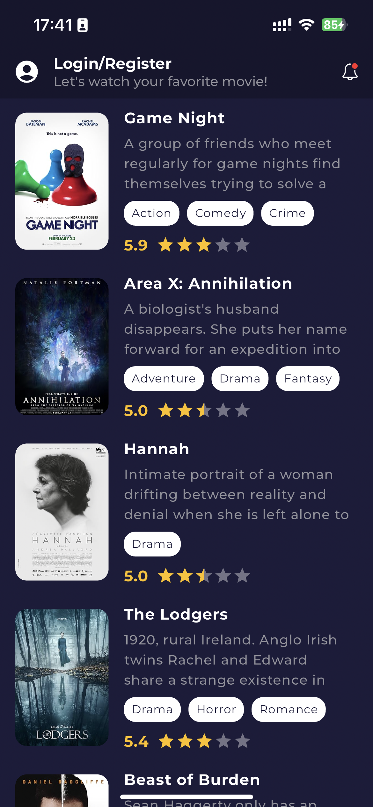
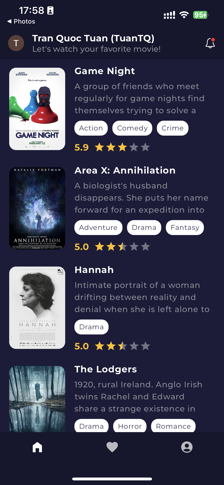
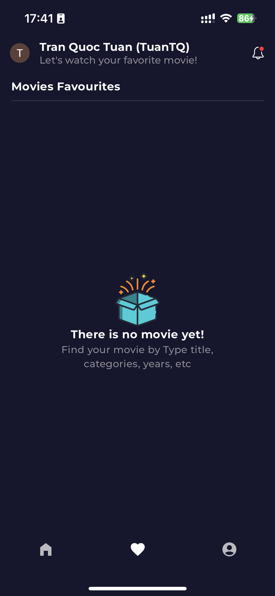
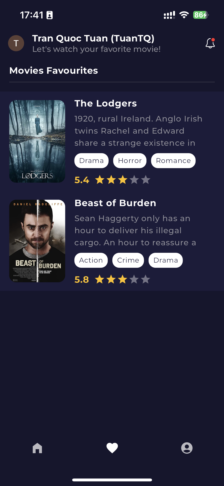
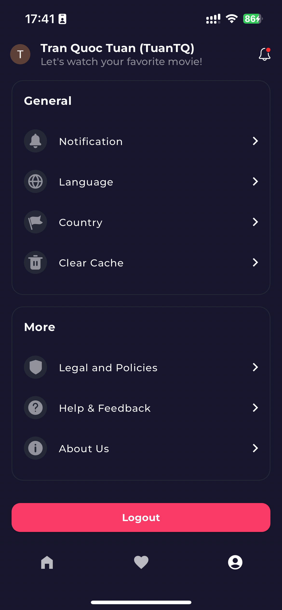
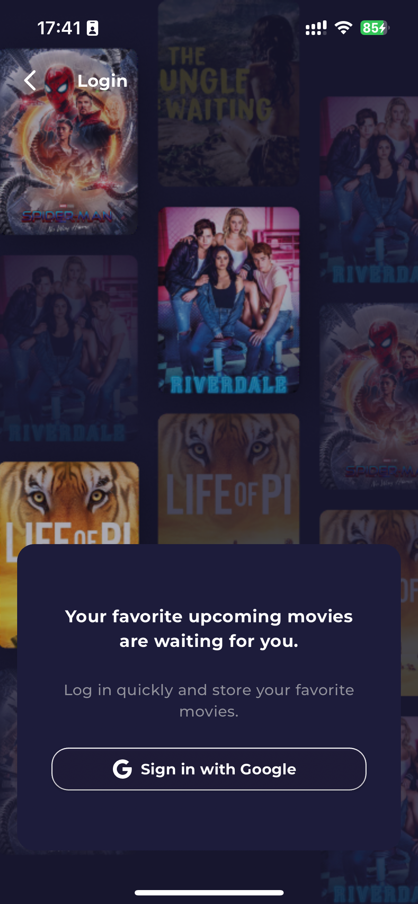

# Movies Application

The interview task is separated into two levels.

You have to cover level 1 as a required stage, but if you continue to the next stage even partially,
this will be counted as bonus points in your assessment.

## Level 1 (Required)

- The app must be written with Flutter
- The code should be published in a public GitHub repository.
  - Incremental commits are considered an advantage.
- Fetching Data with network request
  - `GET` https://raw.githubusercontent.com/FEND16/movie-json-data/master/json/movies-coming-soon.json
- Deserialise the json and represent it in a list - Title, poster, rating.
- Items in the list should lead you to a movie details page
- Any effort towards building a better UI/UX experience will be considered an advantage

## Level 2

After completing the required tasks in the first level, you can continue with next-level tasks.
Every task in this list will give you bonus points.

- Implement user authentication (Firebase, Auth0, etc.) (up to 10 points)
- Ability for the user to save movies to their watch list. The implementation is entirely up to the
  candidate. (up to 10 points)
- User profile page (up to 15 points)
- The code should be easily reusable and maintainable. Code separation, small widgets, loose
  coupling, etc. (up to 20 points)

## Run the app

- Run `flutter pub get` to install the dependencies
- Run `dart run build_runner build --delete-conflicting-outputs --verbose` in auto generator

## Video

Link: https://drive.google.com/file/d/1uiuSOsBQBkpDHarkGi6g8GJMhheSsFwZ/view?usp=sharing

## Screenshots

### Home Page

### Favourite Page

 

### Movie Detail Page

### Profile Page

### Auth Login with Google Page

